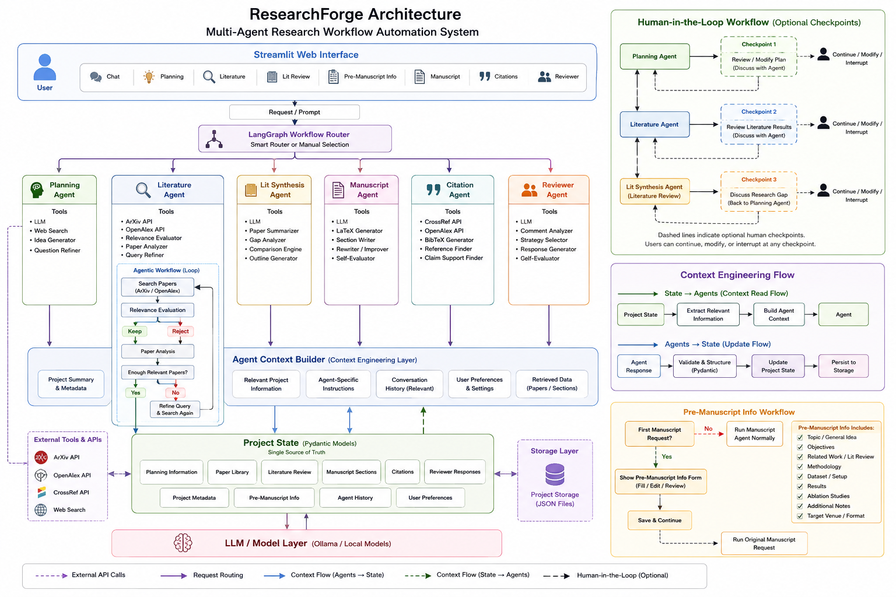

# 📚 ResearchForge

### Multi-Agent Research Workflow Automation System



ResearchForge is an **agentic AI platform** that assists researchers across key stages of the academic research lifecycle through six specialized agents for **research planning, literature discovery, literature synthesis, manuscript drafting, citation management, and reviewer response generation**.

Built with **LangGraph, Pydantic, Streamlit, and LLMs**, ResearchForge combines automated agent workflows with optional human checkpoints, allowing researchers to stay in control while automating repetitive research tasks.

---

## 🚀 Why ResearchForge?

Academic research involves repetitive tasks such as literature discovery, paper analysis, literature review generation, manuscript drafting, citation management, and reviewer response preparation.

ResearchForge organizes these tasks into specialized agents and provides a persistent project workspace where research information, papers, manuscript sections, citations, and reviewer responses can be maintained throughout the project.

The system supports both **automated agent selection** and **direct agent execution**, making it useful for both end-to-end workflows and individual research tasks.

---

## ✨ Features

### 🧠 Research Planning
- Generate research ideas and project directions
- Define objectives, scope, and research questions
- Identify potential research gaps

### 📄 Literature Discovery & Analysis
- Search research papers using ArXiv and OpenAlex
- Evaluate paper relevance before full analysis
- Analyze selected papers and maintain a project paper library
- Iteratively refine searches when relevant literature is insufficient

### 📖 Literature Synthesis
- Generate structured literature reviews
- Compare findings across analyzed papers
- Identify research gaps and emerging research directions

### ✍️ Manuscript Generation
- Generate publication-ready LaTeX sections
- Generate, rewrite, improve, or continue existing sections
- Support dynamically named manuscript sections
- Perform bounded self-evaluation and revision
- Maintain a dedicated Pre-Manuscript Information workspace

### 📑 Citation Management
- Generate BibTeX entries
- Retrieve citation metadata
- Find references supporting specific research claims
- Iteratively refine searches when supporting evidence is insufficient

### 📝 Reviewer Response
- Interpret reviewer comments
- Determine response strategies such as defend, clarify, revise, or add experiments
- Generate structured rebuttals
- Suggest corresponding manuscript revisions
- Self-evaluate responses for relevance and tone

### 🧭 Agentic Workflow
- LLM-based semantic routing
- Agent-specific context engineering
- Bounded iterative workflows
- Optional human-in-the-loop checkpoints
- Continue, modify, or interrupt workflows at major research stages

### 💾 Project Workspace
- Persistent project state using structured Pydantic models
- Save and resume research projects
- Editable research and manuscript information
- JSON-based project storage
- Streamlit-based interactive workspace

### 🎛️ Flexible Execution
- **Smart Router** for automatic agent selection
- **Manual Agent Selection** for direct agent execution
- Normal chat remains available throughout the workspace

---


## 🛠️ Tech Stack

| Technology | Purpose |
|---|---|
| Python | Core application and agent development |
| LangGraph | Agent orchestration and workflow routing |
| Pydantic | Structured state and data validation |
| Ollama | Local LLM inference |
| Streamlit | Interactive research workspace |
| ArXiv API | Research paper discovery |
| OpenAlex API | Literature discovery and metadata |
| CrossRef API | Citation metadata and BibTeX retrieval |
| JSON | Persistent project storage |

## 🚀 Getting Started

### Clone the Repository

```bash
git clone https://github.com/SSanjay0614/ResearchForge.git
cd ResearchForge
```

### Install Dependencies

```bash
pip install -r requirements.txt
```

### Pull the Local LLM

```bash
ollama pull gemma4
```

### Launch ResearchForge

```bash
streamlit run frontend/app.py
```


The application opens with the Project Manager, where users can create a new
research project or open an existing one.

The workspace provides dedicated sections for:

Chat
Planning
Literature
Literature Review
Pre-Manuscript Info
Manuscript
Citations
Reviewer


## 📑 Citation Handling

ResearchForge supports both paper-level BibTeX generation and claim-based
reference retrieval.

For papers with DOI information, CrossRef metadata can be used directly.
For papers without DOI information, the system can search CrossRef using the
paper title and retrieve matching citation metadata when available.

## 🔮 Future Work

- Overleaf synchronization
- Journal-specific manuscript templates
- Multi-user collaboration
- Cloud deployment

## 👨‍💻 Author

Sanjay S

B.Tech Computer Science and Engineering

VIT Chennai
